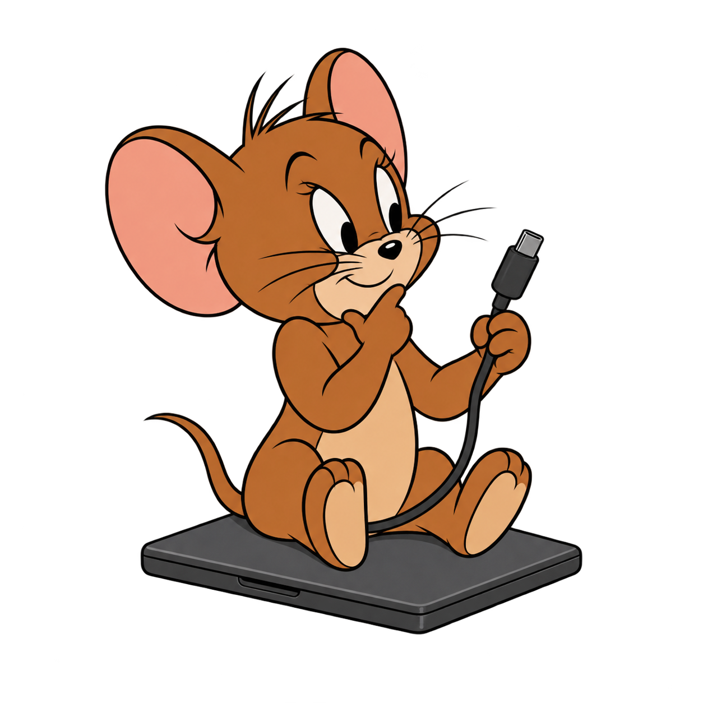
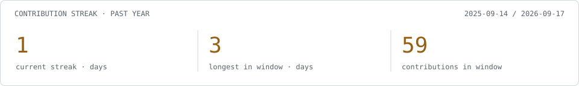
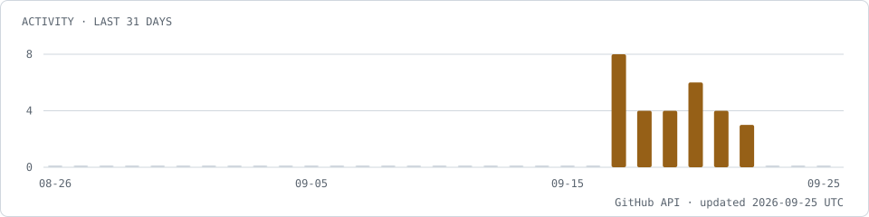

<picture>
  <source media="(prefers-color-scheme: dark)" srcset="assets/header-dark.svg">
  
</picture>

我是 Jerry，复旦大学软件工程本科生。

最近在沿着 **LLM → Systems** 这条线往下学：从一个 token 怎么变成 logits，到训练和推理时，计算、内存和硬件分别在做什么。

我喜欢把不太懂的东西拆小，写一遍，再做成能跑的实验或能看懂的教程。

[项目 / Projects](#on-the-workbench) · [工具 / Tools](#tools-i-reach-for) · [动态 / Activity](#from-github)

## Going down the stack

<picture>
  <source media="(prefers-color-scheme: dark)" srcset="assets/learning-path-dark.svg">
  
</picture>

### Current focus

| 状态 | 最近关心的问题 | 线索 |
| :--- | :--- | :--- |
| `learning` | 一个 Transformer 的前向传播，每一步到底算了什么？ | Karpathy 系列 · GPT / nanoGPT · BPE |
| `practicing` | 微调改变了什么，模型又会在哪些样本上出错？ | PyTorch · Hugging Face · 分类实验 |
| `foundations` | 从程序到机器，数据怎么表示、移动和计算？ | CS61 系列 · CS170 · CSAPP |
| `next` | 训练和推理的开销在哪里，怎么测、怎么优化？ | CS336 · LLM systems · AI infra |

展开学习路线 / reading &amp; building notes

- **程序与系统基础**：CS61A / CS61B / CS61C、CS170、CSAPP；公开记录见 [CS61A](https://github.com/Icyjerry/cs61a-projects) 和 [CS61B](https://github.com/Icyjerry/CS61B)。
- **从零理解模型**：沿 Karpathy 的 micrograd、makemore、GPT / nanoGPT、tokenizer / BPE、GPT-2 reproduction 路线学习。
- **训练与后训练**：用 PyTorch、Hugging Face 做实验，继续了解 LLM fine-tuning / post-training。
- **往下探索**：为 CS336 补基础，逐步学习推理、内存、runtime 和分布式训练。

这里记录学习方向；没有把课程、教程或计划写成已完成的成果。

## On the workbench

<table>
<tr>
<td width="50%" valign="top">
01 / OPEN THE MODEL
<h3><a href="https://github.com/Icyjerry/transformer-32-vocab-tutorial">32 词表 Transformer</a></h3>

把一次前向传播拆到张量形状：embedding、attention、MLP，再到 logits。附可运行的 PyTorch 示例。

<code>PyTorch</code> <code>shapes &amp; attention</code>
</td>
<td width="50%" valign="top">
02 / RUN THE EXPERIMENT
<h3><a href="https://github.com/Icyjerry/distilbert-emotion-classification-lab">DistilBERT 情绪分类</a></h3>

从特征提取到微调，再回头看错误样本。记录模型怎么用，以及实验结果怎么读。

<code>Hugging Face</code> <code>fine-tuning</code>
</td>
</tr>
<tr>
<td width="50%" valign="top">
03 / MEASURE THE CODE
<h3><a href="https://github.com/Icyjerry/cpp-sorting-experiment">C++ 排序实验</a></h3>

归并排序的小数组换成插入排序，什么时候更快？保留实现、基准数据和分析。

<code>C++</code> <code>algorithms &amp; benchmarks</code>
</td>
<td width="50%" valign="top">
04 / MAKE IT DO SOMETHING
<h3><a href="https://github.com/Icyjerry/mahjong-bot">Mahjong Bot</a></h3>

从屏幕识别麻将牌，跟踪牌局，再连接策略。把识别、状态和决策放到一起。

<code>Python</code> <code>OpenCV</code>
</td>
</tr>
</table>

其他实验、小工具和课程项目

| 仓库 | 做了什么 |
| :--- | :--- |
| [CIFAR-10 CNN](https://github.com/Icyjerry/cifar10-cnn) | 从 LeNet 到更深的卷积网络，做图像分类练习。 |
| [Fourier Explained](https://github.com/Icyjerry/fourier-explained) | 可以调参数的傅里叶变换讲解网页。 |
| [VR Classroom](https://github.com/Icyjerry/vr-classroom) | Three.js / WebXR 虚拟课堂 demo。 |
| [Game Platform](https://github.com/Icyjerry/game-platform) | Java 课程里的游戏大厅。 |
| [数模 skill](https://github.com/Icyjerry/cumcm-vibecoding) | 整理建模、实验和结果核验流程。 |

## Tools I reach for

<table>
<tr>
<td width="50%" valign="top">
<strong>Languages</strong>  
     
Python · C / C++ · Java · Shell
</td>
<td width="50%" valign="top">
<strong>Models &amp; experiments</strong>  
  
PyTorch · Hugging Face · Jupyter · Conda / uv
</td>
</tr>
<tr>
<td valign="top">
<strong>Systems workbench</strong>  
  
Linux · shell · computer systems coursework
</td>
<td valign="top">
<strong>Everyday tools</strong>  
   
Git · VS Code · JetBrains
</td>
</tr>
</table>

## From GitHub

<picture>
  <source media="(prefers-color-scheme: dark)" srcset="assets/github/stats-dark.svg">
  
</picture>
<picture>
  <source media="(prefers-color-scheme: dark)" srcset="assets/github/languages-dark.svg">
  
</picture>

<picture>
  <source media="(prefers-color-scheme: dark)" srcset="assets/github/streak-dark.svg">
  
</picture>

<picture>
  <source media="(prefers-color-scheme: dark)" srcset="assets/github/activity-dark.svg">
  
</picture>

每日更新。语言占比来自公开仓库代码量（不含本主页），不代表熟练度。连续贡献统计范围为近一年；今天尚无贡献时，连续天数可延续到昨天。

---

欢迎在具体项目里提 issue，讨论实现、实验结果，或者哪里还没讲清楚。

<a href="MAINTENANCE.md">About this README / assets &amp; data sources</a>
