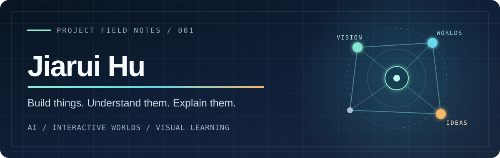

  <strong>胡家瑞 / Jerry Hu</strong> · Software Engineering @ Fudan University 
  我喜欢把想法做成能运行的东西，再把它解释清楚。

## Explore my work

### 01 / 看见，然后决策

从图像与数据中提取信息，再让程序做出可检查的判断。

- [Mahjong Bot](https://github.com/Icyjerry/mahjong-bot) — 截图识别、牌局状态与策略引擎组成的日麻助手。
- [CIFAR-10 CNN](https://github.com/Icyjerry/cifar10-cnn) — 从 LeNet 到更深的卷积网络，比较图像分类实验。
- [Emotion Classification Lab](https://github.com/Icyjerry/distilbert-emotion-classification-lab) — DistilBERT 特征提取、微调与错误分析。

### 02 / 构建可以探索的空间

把交互、规则和视觉反馈放进同一个作品里。

- [VR Classroom](https://github.com/Icyjerry/vr-classroom) — 基于 Three.js 与 WebXR 的虚拟课堂演示。
- [Game Platform](https://github.com/Icyjerry/game-platform) — Java 多游戏大厅，包含国际象棋、黑白棋、扫雷与和平棋。

### 03 / 把抽象概念画出来

我也喜欢做能跟着读、跟着运行的教学材料。

- [Transformer, 32 Tokens](https://github.com/Icyjerry/transformer-32-vocab-tutorial) — 用极小模型追踪 embedding、attention 和 logits 的张量形状。
- [Fourier Explained](https://github.com/Icyjerry/fourier-explained) — 从声音到频谱的交互式傅里叶教学。
- [C++ Sorting Experiment](https://github.com/Icyjerry/cpp-sorting-experiment) — 用可复现的计时比较插入、归并与混合排序。

## Workbench

`Python` · `PyTorch` · `OpenCV` · `Java` · `C++` · `JavaScript` · `Three.js` · `WebXR`

课程练习在 [CS61A Projects](https://github.com/Icyjerry/cs61a-projects) 和 [CS61B](https://github.com/Icyjerry/CS61B)；数模工作流程整理在 [CUMCM VibeCoding](https://github.com/Icyjerry/cumcm-vibecoding)。

Build → inspect → explain → build again.

