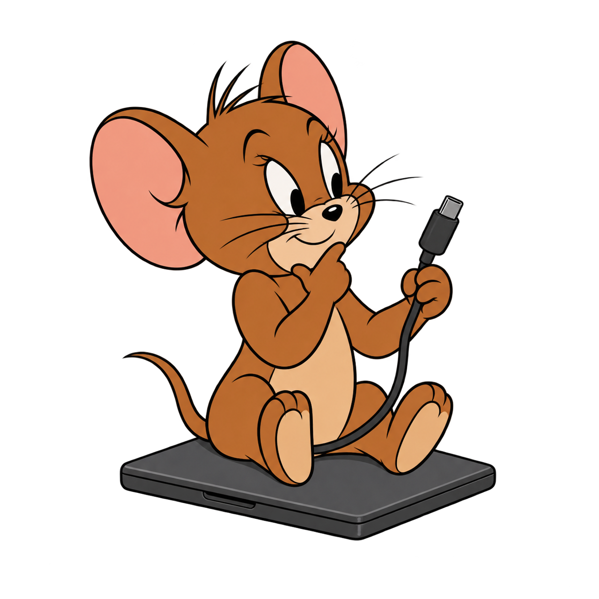
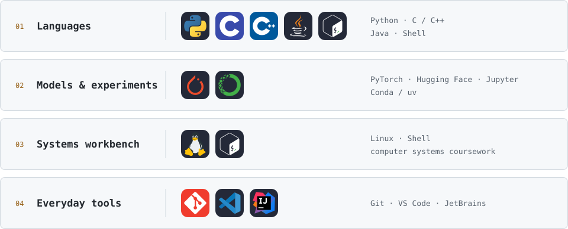
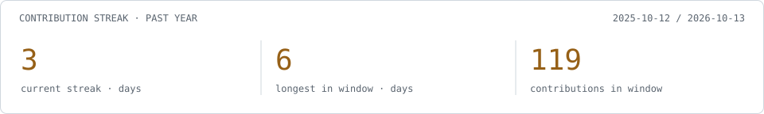
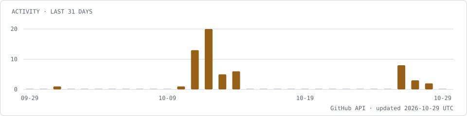

<picture>
  <source media="(prefers-color-scheme: dark)" srcset="assets/header-dark.svg">
  
</picture>

  Software Engineering undergraduate · Fudan University

  <em>
    From words to weights, from code to core, 
    I trace each layer, then one more. 
    I take apart and build anew, 
    And share the things I've learned to do.
  </em>

  <a href="#on-the-workbench">Projects</a> &nbsp; / &nbsp;
  <a href="#tools-i-reach-for">Tools</a> &nbsp; / &nbsp;
  <a href="#from-github">Activity</a>

 

## Going down the stack

<picture>
  <source media="(prefers-color-scheme: dark)" srcset="assets/learning-path-dark.svg">
  
</picture>

### Current focus

| Focus | What I'm working through | Resources |
| :--- | :--- | :--- |
| `learning` | Tracing a Transformer, from tokens to logits. | Karpathy's series · GPT / nanoGPT · BPE |
| `practicing` | Fine-tuning models and inspecting their mistakes. | PyTorch · Hugging Face · classification experiments |
| `foundations` | How programs represent, move, and compute with data. | CS61 series · CS170 · CSAPP |
| `next` | Measuring and optimizing training and inference. | CS336 · LLM systems · AI infra |

Reading &amp; building notes

- **Programming and systems foundations**: CS61A / CS61B / CS61C, CS170, and CSAPP. Public coursework: [CS61A](https://github.com/Icyjerry/cs61a-projects) and [CS61B](https://github.com/Icyjerry/CS61B).
- **Models from scratch**: learning through Karpathy's micrograd, makemore, GPT / nanoGPT, tokenizer / BPE, and GPT-2 reproduction series.
- **Training and post-training**: experimenting with PyTorch and Hugging Face while learning more about LLM fine-tuning and post-training.
- **Further down the stack**: building foundations for CS336 and gradually exploring inference, memory, runtimes, and distributed training.

This map covers ongoing study and future plans.

## On the workbench

<table>
<tr>
<td width="50%" valign="top">
01 / OPEN THE MODEL
<h3><a href="https://github.com/Icyjerry/transformer-32-vocab-tutorial">Tiny Transformer</a></h3>

A 32-token vocabulary, one forward pass, every tensor shape. Includes a runnable PyTorch example.

<code>PyTorch</code> <code>shapes &amp; attention</code>
</td>
<td width="50%" valign="top">
02 / RUN THE EXPERIMENT
<h3><a href="https://github.com/Icyjerry/distilbert-emotion-classification-lab">DistilBERT Lab</a></h3>

Emotion classification with feature extraction, fine-tuning, and a closer look at the errors.

<code>Hugging Face</code> <code>fine-tuning</code>
</td>
</tr>
<tr>
<td width="50%" valign="top">
03 / MEASURE THE CODE
<h3><a href="https://github.com/Icyjerry/cpp-sorting-experiment">Sorting Experiment</a></h3>

Merge sort meets insertion sort. Implementations, benchmarks, and the cost of small subarrays.

<code>C++</code> <code>algorithms &amp; benchmarks</code>
</td>
<td width="50%" valign="top">
04 / MAKE IT DO SOMETHING
<h3><a href="https://github.com/Icyjerry/mahjong-bot">Mahjong Bot</a></h3>

Read the tiles, track the game, choose a move. Screen recognition connected to a strategy engine.

<code>Python</code> <code>OpenCV</code>
</td>
</tr>
</table>

More experiments, tools, and coursework

| Repository | What I built |
| :--- | :--- |
| [CIFAR-10 CNN](https://github.com/Icyjerry/cifar10-cnn) | Image classification experiments, from LeNet to deeper convolutional networks. |
| [Fourier Explained](https://github.com/Icyjerry/fourier-explained) | An interactive Fourier transform explainer with adjustable parameters. |
| [VR Classroom](https://github.com/Icyjerry/vr-classroom) | A virtual classroom demo built with Three.js / WebXR. |
| [Game Platform](https://github.com/Icyjerry/game-platform) | A multi-game platform from my Java coursework. |
| [Mathematical Modeling Skill](https://github.com/Icyjerry/cumcm-vibecoding) | A reusable workflow for mathematical modeling, experiments, and result verification. |

## Tools I reach for

<picture>
  <source media="(max-width: 600px) and (prefers-color-scheme: dark)" srcset="assets/tools-mobile-dark.svg">
  <source media="(max-width: 600px)" srcset="assets/tools-mobile-light.svg">
  <source media="(prefers-color-scheme: dark)" srcset="assets/tools-desktop-dark.svg">
  
</picture>

## From GitHub

<picture>
  <source media="(prefers-color-scheme: dark)" srcset="assets/github/stats-dark.svg">
  
</picture>
<picture>
  <source media="(prefers-color-scheme: dark)" srcset="assets/github/languages-dark.svg">
  
</picture>

<picture>
  <source media="(prefers-color-scheme: dark)" srcset="assets/github/streak-dark.svg">
  
</picture>

<picture>
  <source media="(prefers-color-scheme: dark)" srcset="assets/github/activity-dark.svg">
  
</picture>

Updated daily. Language shares reflect code volume in public repositories, excluding this profile; they do not measure proficiency. Streaks use the past-year calendar, and the current streak may end yesterday while today is still empty.

---

Feel free to open an issue in a project to discuss the implementation, experiment results, or anything that could use a clearer explanation.

<a href="MAINTENANCE.md">About this README / assets &amp; data sources</a>
